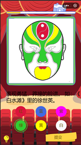
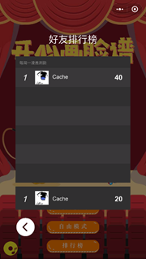
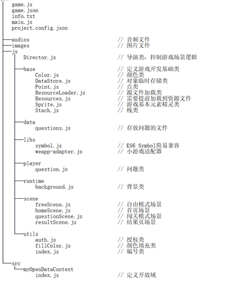

# 一 游戏内容介绍

## 1.1 游戏基础信息

2019中国高校计算机大赛微信小程序应用开发赛（小游戏类别） 全国三等奖作品

| **小游戏名称**          | 开心画脸谱                                                   |
| ----------------------- | ------------------------------------------------------------ |
| **小游戏头像**          |                    |
| **小程序码**            |                    |
| **服务类目**            | 游戏 > 休闲游戏                                              |
| **AppID(****小程序ID)** | wxe923e1a3e62a8495                                           |
| **游戏介绍**            | 这是一款京剧脸谱填色游戏。弘扬传统文化，感悟国粹精华，了解京剧脸谱知识，学习脸谱如何表现情感，绘制属于自己的脸谱，和好友一比高下，爱上京剧原来如此简单！ |

## 1.2 游戏背景

京剧是我国的国粹，也被列入“人类非物质文化遗产代表作名录”，而京剧脸谱是京剧表达的一种特殊方式，其化妆有特定的技巧，脸谱在国内外都非常受人追捧，它以夸张的颜色色彩和充满变化的曲线勾画而成，**脸谱的色彩和线条的运用有一定的内容和含义，它是表现人物性格的主要因素**。

比如从色彩上说，现在的京剧脸谱有红、紫、黑、白、蓝、绿、黄、粉红、瓦灰、金、银等色，这是从人物自然肤色的夸张描写、发展为性格象征的寓意用色。一般说来，红色描绘人物的赤胆志己；紫色象征智勇刚强；黑色体现人物富有忠耿正直的高贵品格。而京剧脸谱的构图则更加多种多样，加上五彩缤纷、装饰性很强的各种图案，容易使人眼花缭乱，产生神秘感。

俗话说看人先看脸，一个人的脸像给人的第一眼的感觉是不一样的，由此可以判断这个人的品相性格。京剧充分的利用了这一点来表现人物性格，丰富人物形象。

>“京剧脸谱，是根据某种性格、性情或某种特殊类型的人物为采用某些色彩的。红色有脸谱表示忠勇士义烈，如关羽、姜维、常遇春；黑色的脸谱表示刚烈、正直、勇猛甚至鲁莽，如包拯、张飞、李逵等；黄色的脸谱表示凶狠残暴，如宇文成都、典韦。蓝色或绿色的脸谱表示一些粗豪暴躁的人物，如窦尔敦、马武等；白色的脸谱一般表示奸臣、坏人，如曹操、赵高等。”               
>——摘自中国国家京剧院官网

## 1.3 与中国传统文化的结合

“开心画脸谱”通过让玩家自己为京剧脸谱填色，让玩家在回答问题的过程中学习京剧脸谱知识，在创作京剧脸谱的过程中感受京剧文化，同时通过分享机制让玩家在朋友圈中传播京剧国粹，普及京剧知识，同时了解京剧脸谱的色彩运用和线条运用也可以深入人们对于京剧的理解赏析。

该小游戏从京剧脸谱文化出发，**旨在普及人们对京剧脸谱的了解，学习脸谱不同颜色和线条对于性格的表现方式，激发人们对京剧文化的兴趣，使人们在观看京剧时更加容易理解戏剧内在表现情感，使年轻人也喜欢上看京剧、看得懂京剧。**

## 1.4 扮演角色

玩家在游戏中的两个模式内可以分别扮演两个角色，具体如下：

### 1.4.1 闯关模式

玩家在该模式内作为**答题者**进行闯关，需要按照题目描述绘制符合相关要求的京剧脸谱，系统会根据玩家答题情况做出判定并打分。

### 1.4.2 自由模式

玩家在该模式内作为**创作者**自由进行脸谱的绘画，可以根据自己对京剧脸谱的理解绘制表现自己情感或性格的脸谱。

                                


## 1.5 玩法

游戏中主要提供了两种玩法，以满足玩家对京剧脸谱的基础知识的学习，以及玩家对于京剧脸谱的再创作。

### 1.5.1 闯关模式

该模式系统会随机从数据库中抽取5道有关京剧脸谱的题目，题目难度从简到难不等，题目内容范围是色彩和线条在京剧脸谱中的表现内涵。玩家需要理解题目内容，结合相关基本知识以及自己的想象，**使用不同的颜色在画板上的空白脸谱进行填色，以满足题目描述中需要表现的情感或性格**。

在玩家对于题目作答有难度时，系统会在合适时间向玩家提供**小提示**，小提示的内容为题目相关的脸谱知识，使玩家在娱乐的同时学习京剧脸谱知识。

在玩家完成所有题目作答之后，系统会根据玩家作答情况评分，评分方法为检测脸谱中三大主要区域的颜色，三大区域包括：额头、脸颊、下巴；系统将玩家对这三个区域的填色与题目要求所表现的性格对应的色彩对比来判断是否正确；最后系统会根据作答情况**生成成绩单以及评语**。

最后系统将会记录用户完成的得分，去历史最高分在排行榜中参与和好友的排行。




### 1.5.2 自由模式

在玩家对脸谱的基础知识有所了解之后，玩家可以进入“自由模式”自由创作；**玩家根据自己的理解结合脸谱知识进行任意创作，来绘制出表达玩家自己想要表达的情感或性格**；玩家可以选择多种空白的脸谱图案，然后使用不同颜色的画笔在脸谱上进行涂色。

玩家创作完成后可以保存自己的创作成果至相册，与好友分享。


## 1.6 功能（系统）

### 1.6.1 绘图系统：

绘图系统主要包括两个部分：画板和画笔。画家在选择不同颜色的画笔后，通过在画板上触摸“闭合区域”，可在画板上的对应区域填充对应的颜色；同一区域可以多次填色，同一画板中可以选择多个颜色进行填色；如图5所示。




### 1.6.2 答题系统

答题系统主要包括两个部分：出题和判定。系统在初始化时从题库中随机抽取难度不一的题目数据，题目数据包含文本、图片、答案和提示等信息，系统为题目集合标上序号，用于之后的题目展示。判定部分会对脸谱的特定区域进行颜色检测，以检测玩家的做题情况。

### 1.6.3 排行榜系统

排行榜系统保存了玩家在闯关系统的答题分数，并根据玩家及其好友的答题最高分进行排序，按照从高到低的顺序绘制在跑行榜上；如图6所示。

### 1.6.4 保存截图功能

玩家在闯关模式的成绩单界面或自由模式中可以使用”保存截图”功能保存自己的成绩单或脸谱作品，系统会将截图保存到手机相册中，便于玩家与好友的分享。

### 1.6.5 背景音乐及控制

本游戏中选择了“传奇乐坊”的京胡独奏《夜深沉》作为背景音乐，它的曲调由繁至简，在快板段落作了较多发展，其中有大鼓的独奏及鼓与京胡的竞奏，使原曲的精华刚劲且优美的音乐得到充分优美的表现。在京剧《击鼓骂曹》和《霸王别姬》中，用 它来配合祢衡击鼓和虞姬舞剑等的场面。

玩家可以在游戏主页控制背景音乐的开启与关闭。

## 1.7 主要特点

### 1.7.1 弘扬国粹文化，普及京剧脸谱知识

现在年轻人大多对国粹京剧不大了解，其原因大多是京剧的表现形式晦涩难懂，看不懂京剧表演的内在含义，年轻人难以接受。现在网络上的京剧相关知识仅仅是通过新闻等文本方式向大众普及京剧知识，大众接受度差，**而小游戏、视频等新兴的方式深受年轻人喜爱，但相关题材的内容却几乎空白**。

本游戏面向这个问题，通过游戏的形式向玩家普及京剧脸谱知识，亲身创作去感受脸谱的情感，从而帮助人们去了解脸谱背后所表现的含义，而让更多的人去接受京剧，了解京剧。

### 1.7.2 将画图和答题相结合的形式

由于每个人对于艺术的理解都不完全相同，小游戏中将画图与答题的形式相结合，不去规定所谓的“标准答案”，充分给予玩家自由创造的空间，鼓励玩家将自己的想法表现出来，只要基本色彩运用满足要求，即可回答正确。

这样的设计可以**摆脱传统按选项答题的模式，在创作的过程中学习京剧脸谱知识，不像教材文本那样晦涩难懂，玩家可玩空间大，玩家游戏沉浸度更高**。

### 1.7.3 引入排行榜和分享功能

​    排行榜和分享功能的引入可以让人们主动的**传播京剧脸谱文化**，激发更多人了解学习京剧知识，在社会掀起京剧学习的热潮。

# 二 软件设计

## 2.1 项目的基本结构

   

## 2.2 主要算法

游戏中的画板部分主要用到了图像填充的算法，来实现用画笔对脸谱进行填色的功能。

图像填充有两种经典算法分别是种子填充法和扫描线填充法。由于种子填充法存在大量的反复入栈和大规模的递归，降低了填充效率，所以程序中使用了**扫描线填充法。**

### 2.2.1 算法基本思想

扫描线填充法的基本过程如下：

- 1.      初始化一个空的栈用于存放种子点，将种子点(x, y)入栈；

- 2.      判断栈是否为空，如果栈为空则结束算法，否则取出栈顶元素作为当前扫描线的种子点(x, y)，y是当前的扫描线；

- 3.      从种子点(x, y)出发，沿当前扫描线向左、右两个方向填充，直到边界。分别标记区段的左、右端点坐标为xLeft和xRight；

- 4. 分别检查与当前扫描线相邻的y - 1和y + 1两条扫描线在区间[xLeft, xRight]中的像素，从xRight开始向xLeft方向搜索，假设扫描的区间为AAABAAC（A为种子点颜色），那么将B和C前面的A作为种子点压入栈中，然后返回第（2）步；

### 2.2.2 算法的具体实现

有关颜色填充的算法主要在项目的 js/utils/fillColor.js 文件中实现，相关函数如下：

```javascript
/**
    @param pixels   像素数组
    @param w        宽度
    @param h        高度
    @param pixel    当前点的颜色
    @param newColor 填充色
    @param i        点的横坐标
    @param j        点的纵坐标
    @decs           这个函数表示在从pixels中以点(I,j)作为种子点开始填充颜色。
   */
    fillColor(pixels, w, h, pixel, newColor, i, j) 
```

说明：这个函数是整个算法的入口，他从一个种子点开始，寻找边界、填色，然后在上下两行继续寻找种子点，种子点是在栈中存放的。

 

```javascript
/**
   @param pixels   像素数组
   @param pixel    当前点的颜色
   @param w        宽度
   @param h        高度
   @param newColor 填充色
   @param x        点的横坐标
   @param j        点的纵坐标
   @decs           这个函数表示在从pixels中点(I,j)向这一行像素的右边搜索边界。
   */
fillLineRight(pixels, pixel, w, h, newColor, x, y)
```

说明：这个函数实现了向右寻找边界的过程。

 

```javascript
/**
    @param pixels   像素数组
    @param pixel    当前点的颜色
    @param w        宽度
    @param h        高度
    @param newColor 填充色
    @param x        点的横坐标
    @param j        点的纵坐标
    @decs           这个函数表示在从pixels中点(I,j)向这一行像素的左边搜索边界。
   */
fillLineLeft (pixels, pixel, w, h, newColor, x, y)
```

说明：这个函数实现了向左寻找边界的过程。


```javascript
/**
    @param pixels   像素数组
    @param pixel    当前点的颜色
    @param index    当前点的位置
    @decs           判断该像素点是否需要涂色
   */
  needFillPixel(pixels, pixel, index) 
```

说明：这个函数实现了对像素点的填色，他需要判断该店是否的比较点颜色相同，即在边界之内，如果相同即可填色；填色的方法是直接在像素数组中写入颜色数据。

 

```javascript
/**
    @param pixels   像素数组
    @param pixel    点的颜色
    @param w        宽度
    @param h        高度
    @param i        所在行数
    @param left     左侧边界
    @param right    右侧边界
    @desc 在新行找种子节点
   */
  findSeedInNewLine(pixels, pixel, w, h, i, left, right)
```

说明：这个函数实现了在一行中寻找种子点的过程。函数会在一个给定的区间内从右向左寻找与比较点颜色不同的像素点，找到之后第一次出现的与比较点颜色一样的像素点将会被作为种子点压入栈中。

#  三、有关项目中图片、音乐等媒体资源使用的说明

项目中部分使用的图片、音乐等媒体资源是从网络上获得，经过了修改、编辑后使用在项目中，特此说明，具体列表如下：

| **资源名称**           | **项目中的名称** | **资源来源**                                |
| ---------------------- | ---------------- | ------------------------------------------- |
| 京剧女印花图片         | character1.png   | http://www.nipic.com/show/15662782.html     |
| Q版京剧人物            | Character2.png   | http://3png.com/a-19447687.html             |
| 卡通简约舞台剧背景图   | bg.jpg           | http://www.51yuansu.com/bg/rssvwiduax.html  |
| 《夜深沉》（京胡独奏） | Music.mp3        | https://www.youtube.com/watch?v=Omd60WdXdLM |